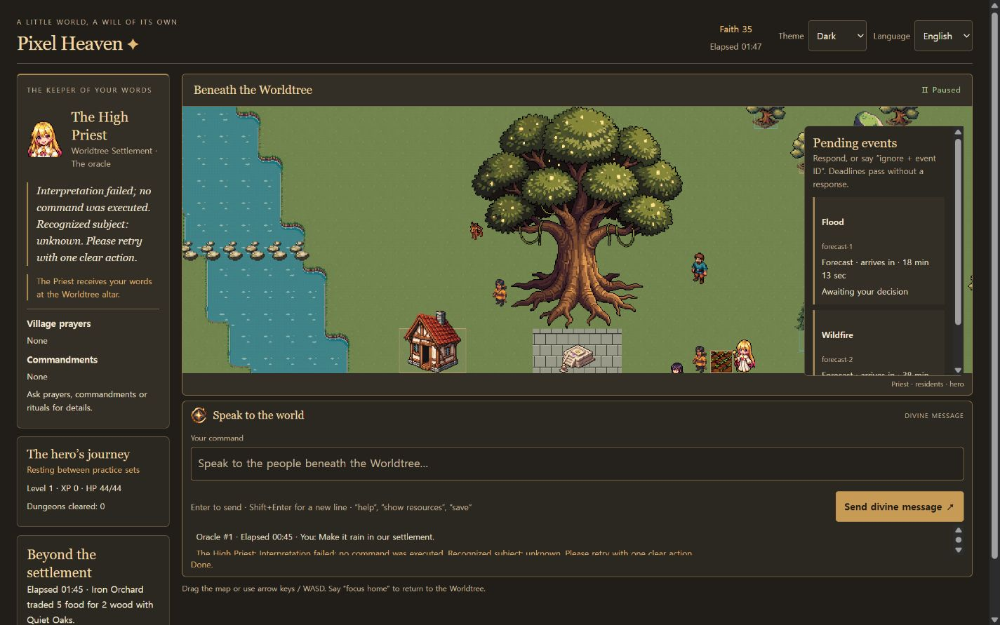

# Pixel Heaven — English Edition

A pixel settlement simulation built around a Worldtree. Send an oracle through chat; the Priest receives it at the altar before the engine validates and executes the action.

This public edition uses English for its interface. Light and dark themes are available in the header. Send a message with the button or **Enter**; use **Shift+Enter** for a new line.

## Run locally

Install Node.js, then run:

```sh
node tools/serve.mjs
```

Open http://localhost:8080 and type **Let there be light**. An internet connection is needed to load PixiJS and the tilemap library from their CDN. Game code uses native JavaScript modules without a build step.

## Playing

Manage one settlement surrounded by 24 autonomous factions. Forecasts announce threats before impact. Faith limits divine intervention; resources, labor and facilities determine what the settlement can build and produce.

- Ask `help`, `show resources`, `status`, `save` or `load`.
- Send `make it rain`, `prepare for battle` or `send the hero to the dungeon`.
- Heroes repeat expeditions until recalled. Equipment grids, dungeon routes, light, elites and bosses affect their progress.
- Caravans support instructed and autonomous trading. Workshops process materials and craft goods.
- Prayers, commandments and rituals connect faith with settlement life.



The screenshot includes a failed real-model oracle from verification. The failure is shown as a failure; it is not a successful rain command.

## AI status

**Demo interpretation is the default.** It recognizes a bounded set of supported expressions. `enable ai` attempts Chrome's on-device Prompt API; it may require a model download. No API key or paid model service is included.

The on-device interpreter is experimental and is **not ready to be relied on for general instructions**. A real Chrome run on 2026-09-27 tested 59 fixed cases: 20 matched expectations, 3 questions were blocked before model invocation, 34 returned a different interpretation, and 2 failed response validation. There were 56 actual model calls. English cases also failed; changing the interface language does not fix the interpretation problem. This is a diagnostic sample, not a benchmark of overall model capability.

A separate experiment using a simpler JSON constraint improved the sample but still had incorrect actions and invalid output. That experimental change has not been applied to the game. Invalid output is rejected by the engine, but a structurally valid, incorrectly interpreted action can still pass validation.

## Verification and structure

The current public snapshot passes 78 Node test scripts and content validation:

```sh
node tools/check.mjs
node tools/validate-content.mjs
```

`src/game` owns simulation; `src/actions` validates effects; `src/llm` interprets requests; `src/ui` renders interface panels; `src/state` owns persistent state. PixiJS rendering is isolated in `src/game/Renderer.js`. Sparse world storage and content registries support extension without a bundler.

This is a work in progress. Balance, browser-model reliability and dedicated elite/boss art need further work.
