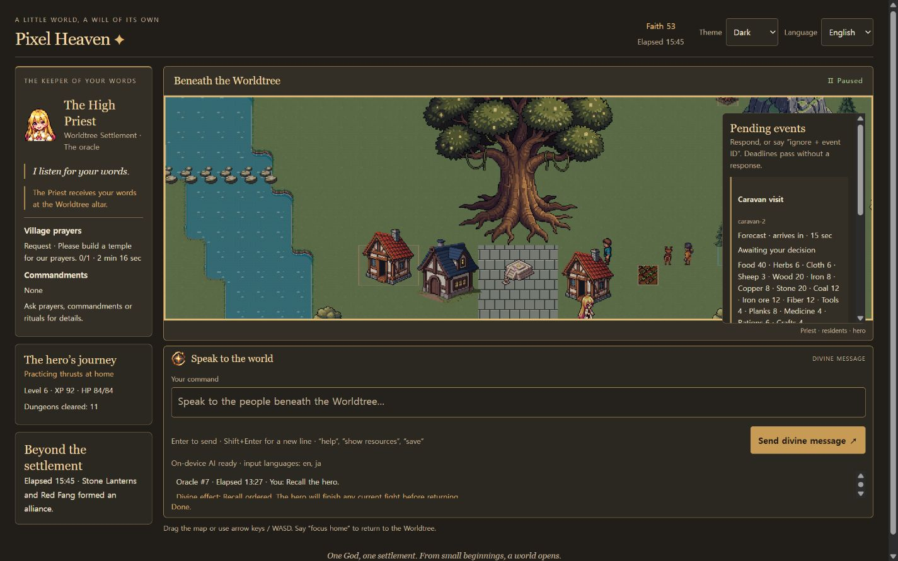

# Pixel Heaven — English Edition

> **Why this exists:** Chrome went ahead and shipped a local LLM (Gemini Nano) into everyone's browser for its own convenience. Leaving it there for Google alone to use felt irritating, so this game was built to put it to work as hard as possible.

A pixel settlement simulation centered on a Worldtree. Speak through chat; the Priest walks to the altar and receives the oracle before the game validates costs and applies an action.

## Run

**Play in your browser: https://jinbumlee95.github.io/Pixel_Heaven_OPEN/**

Open the page and type **Let there be light**. No install is needed. Use desktop Chrome to try the on-device AI (`enable ai`); other browsers play with the built-in demo commands.

To run it locally instead, start `node tools/serve.mjs` and open http://localhost:8080. PixiJS and its tilemap library load from a CDN, so the first load needs internet access. Game code uses native JavaScript modules without a build step.

The public interface is English. Theme and language settings sit in the header. **Enter** or the send button submits a message; **Shift+Enter** adds a line.

## First steps

Your settlement begins with eight people, one house and one field. Its resources and faith grow through the simulation; divine interventions spend faith. Outside it, 24 factions act autonomously. Forecasts give time to respond before threats arrive.

| Goal | Chat command |
| --- | --- |
| Inspect the settlement | `status`, `show resources`, `labor status`, `costs` |
| Start Chrome local AI | `enable ai` |
| Speed up / pause | `speed 4`, `speed 12`, `pause`, `resume` |
| Explore after the hero arrives | `Send the hero to the dungeon.` |
| Bring the hero back | `Recall the hero.` |
| Begin production after gathering materials | `build sawmill`, then `produce planks 3` |
| Inspect production / equipment | `production status`, `recipes`, `equipment` |
| Arrange equipment | In the `equipment` panel, drag an item picture onto a cell (or back to storage), or click it for its stats and command buttons |
| Zoom the map | Mouse wheel, `+` / `-`, or `zoom in` / `zoom out` |
| Prepare for a forecast | `respond forecast-1` (use the visible event ID) |
| Strike raiders during a battle | `smite the raiders` (12 faith, every 8 seconds) |
| See goals and their faith rewards | `legends` |
| Let the settlement handle an event | `ignore forecast-1` |
| Trade during a visit | `buy cloth 2`, `sell wood 5` |
| Adjust expedition policy | `dungeon safe`, `dungeon hunt`, `dungeon treasure` |
| Save / restore | `save`, `load` |
| More commands | `help` |

During a raid you can call down divine lightning on the densest group of raiders. Twelve **legends** (population, houses, workshops, temple, hero level, dungeon clears, a boss, a flawless defense and more) each pay a one-time faith reward with a banner over the map. Between the forecast threats, rare **wonders** bring good fortune: pilgrims, a falling star, a golden harvest, a wandering bard, a faithful dream or a merchant's gift. Wonders use their own saved random stream, so they never change which threats are forecast.

Heroes repeat dungeon runs until recalled, recovering and resupplying when possible. Supplies or cargo capacity can make them wait. Production facilities, a grid equipment inventory, four equipment grades, prayers, commandments and rituals support longer progression. Battle preparations interact with combat terrain and can be cleared afterward.



## On-device AI

Demo commands work by default. `enable ai` uses Chrome's built-in Prompt API when available.

> **Heads-up:** the first `enable ai` may make Chrome download its on-device model, which is several gigabytes. The download starts only when you type `enable ai`, never on page load, and Chrome keeps the model for later visits. Devices without enough free storage cannot install it; the game then keeps running with demo commands.

No API key or paid model service is included. Availability depends on the browser, operating system and hardware; see [Google's Prompt API documentation](https://developer.chrome.com/docs/ai/prompt-api).

The local model chooses a compact intent. A separate fresh model conversation checks whether the proposed action matches the entire request. At most one repair is attempted, within the request deadline. The engine still validates the target, parameters, inventory, faith and current world state. Failed model requests do not silently switch to demo interpretation.

In the final 2026-09-27 Chrome test, 63 fixed English cases produced **56 expected model results**, **3 pre-model gates** (questions or no world trigger), **2 valid requests declined**, and **2 invalid-output rejections**, across 131 actual model calls. No different executable action was returned in that sample. This is a development sample, not a guarantee for arbitrary language. Valid wording can still be rejected: use the precise commands above or the examples in `help` when needed. `demo mode` explicitly switches back to the bounded command interpreter.

## Verification

```sh
node tools/check.mjs
node tools/validate-content.mjs
```

83 Node test scripts cover simulation, validated actions, persistence, input and regression cases. Three normal-start 30-minute simulations verify workshop construction, production, hero growth, recall and save restoration without injecting resources or faith. Real Chrome desktop checks cover the actual Priest and chat path.

`src/game` owns simulation, `src/actions` validates effects, `src/llm` interprets requests, `src/ui` provides panels and `src/state` owns persistence. PixiJS is isolated in `src/game/Renderer.js`. Sparse world storage and declarative content registries support extension.

This remains a playable prototype. Broader language reliability, long-term balance and dedicated elite/boss art need further work.
