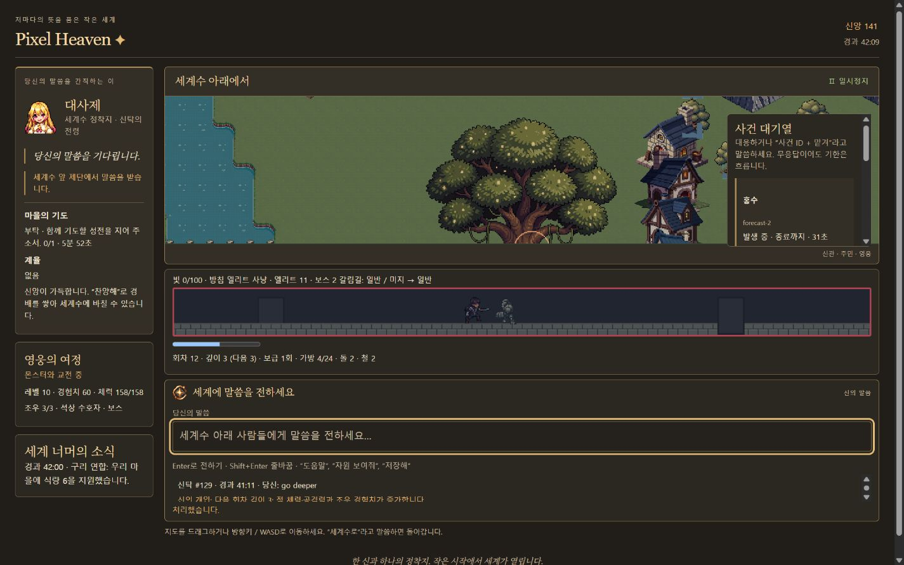

# Pixel Heaven

채팅으로 신탁을 내려 세계수 아래의 작은 정착지를 키우는 픽셀 시뮬레이션 게임입니다. 사제가 제단에서 말씀을 받은 뒤, 게임 엔진이 비용과 조건을 확인해 실행합니다.



## 실행

Node.js와 WebGL을 지원하는 브라우저가 필요합니다. 별도 설치·빌드 과정은 없습니다.

```sh
git clone https://github.com/jinbumlee95/Pixel_Heaven_OPEN.git
cd Pixel_Heaven_OPEN
node tools/serve.mjs
```

http://localhost:8080 에 접속해 `빛이 있으라`를 입력하세요. 첫 로딩에는 CDN의 PixiJS 7.4.3과 @pixi/tilemap 4.1.0을 받아야 하므로 인터넷 연결이 필요합니다. 개발 서버는 로컬 주소에만 연결됩니다.

## 현재 기능

- 플레이어 정착지 하나와 자율적으로 움직이는 외부 세력 24개
- 신앙 비용이 있는 신탁, 사제의 이동과 제단 수신
- 습격·가뭄·산불·홍수·추위 예고와 대응 대기열, 중첩되지 않는 습격
- 검사·궁수·마법사·도적, 엄폐물·장애물·함정과 상호작용하는 방어전
- 자원 17종, 작업장 7종, 제작·교역·노동 배정·건설·복구
- 복귀 지시 전까지 반복하는 영웅 원정, 보급·회복·전리품 운송
- 던전 빛과 갈림길, 엘리트·보스, 네 등급 장비와 채팅으로 조작하는 장비 격자
- 기도 수락, 계율, 의식, 찬양과 세계수 봉헌
- 한국어·영어·일본어, 라이트·다크 테마, JSON 저장·복원과 제한된 데이터 팩

## 채팅 예시

| 입력 | 동작 |
|---|---|
| `도움말` | 지원 표현 확인 |
| `자원 보여줘` | 현재 재고 확인 |
| `알아서 전투 준비해` | 예고된 습격에 방어 준비 |
| `전투 끝나면 정리해` | 방어시설 정리 예약 |
| `영웅 파견` / `영웅 복귀` | 원정 시작 / 복귀 지시 |
| `던전 현황` | 빛·방침·갈림길과 명령 안내 |
| `던전 엘리트 노려` | 이후 갈림길의 기본 선택 방침 변경 |
| `던전 횃불 보급` | 가능한 원정 단계에서 석탄을 써 빛 보충 |
| `커먼 자동 분해 켜` | 미잠금 보관 장비의 자동 정리 |
| `장비` / `격자 닫아` | 장비 현황 열기 / 닫기 |
| `종교` | 기도·계율·의식 현황 |
| `저장해` / `불러와` | 브라우저에 저장 / 복원 |
| `내보내기` / `파일 가져오기` | JSON 저장 파일 사용 |
| `언어 일본어` / `다크 모드` | 표시 언어 / 테마 변경 |
| `일시정지` / `계속` | 진행 정지 / 재개 |

조회·설정과 실제 개입은 구분됩니다. 원정·시설·자원 관련 지시는 현재 상태, 자재와 신앙에 따라 거절될 수 있습니다. 지도는 드래그하거나 방향키·WASD로 이동합니다.

## 언어 해석

기본 데모 모드는 지원된 표현을 규칙으로 해석합니다. 임의의 자연어를 모두 이해하는 모드는 아닙니다. 호환 브라우저에서는 `ai 활성화`로 선택적 로컬 언어 모델을 사용할 수 있습니다. 지원 여부와 언어는 브라우저 환경에 따라 달라지며, 실제 모델의 배포 환경 검증은 아직 남아 있습니다.

모델은 구조화된 명령만 반환합니다. 게임 상태는 엔진 검증 뒤에 바뀝니다. 활성 모델의 응답이 실패하면 다른 명령으로 대신 실행하지 않고 실패를 안내합니다. 이 공개본은 외부 유료 API 호출 도구나 API 키를 포함하지 않습니다.

## 구조와 검사

자체 코드는 빌드 도구 없이 네이티브 JavaScript ES 모듈을 사용합니다. PixiJS 렌더링은 `Renderer.js`에 모았고, 2000×2000 지도 전체를 매번 순회하지 않습니다. 게임 진행과 화면 애니메이션도 분리했습니다.

```text
src/game/       시뮬레이션·원정·전투·제작·사건
src/actions/    행동 검증과 실행
src/llm/        언어 해석과 응답 계약
src/content/    콘텐츠 정의
src/state/      저장·경제 상태
src/ui/        화면 표시
src/i18n/      번역
assets/        게임 리소스
tests/         Node assert 검사와 과거 회귀 fixture
examples/packs/ 데이터 팩 예시
```

```sh
node tools/check.mjs
node tools/validate-content.mjs
```

현재 기준은 Phase 21G입니다. 아직 개발 중이며, 엘리트·보스 전용 그림은 기존 몬스터 시트를 재사용합니다. 캡처는 초기 물자를 보충한 검증 세계의 실제 플레이 화면으로, 일반 플레이의 성장 속도를 뜻하지 않습니다. 게임 아트에는 PixelLab으로 제작한 리소스가 포함됩니다.

[라이트 테마 화면](docs/screenshots/gameplay-light.jpg)
